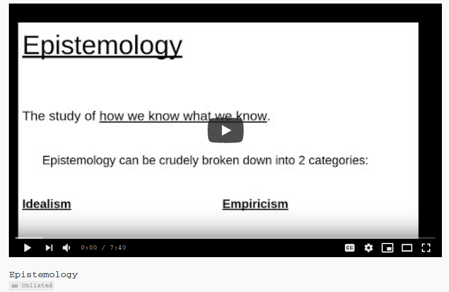
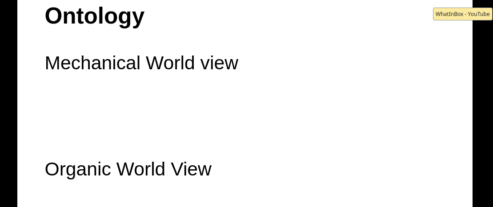
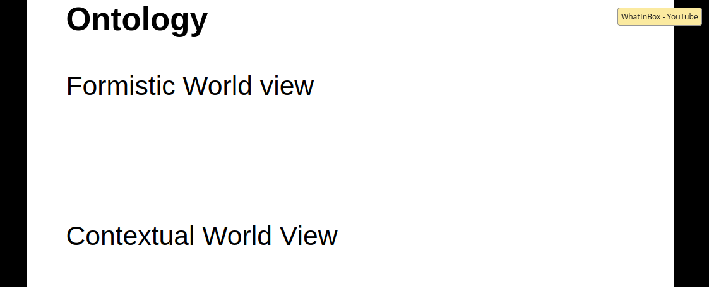
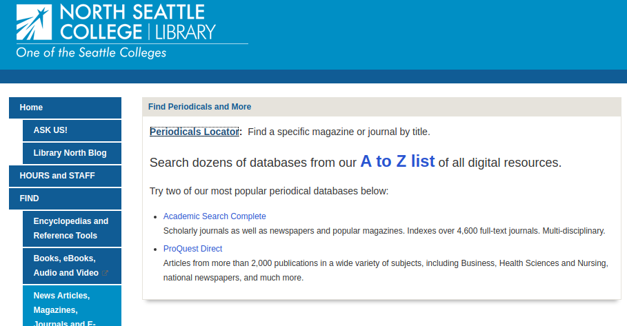

```{r setup, include=FALSE}
knitr::opts_chunk$set(echo = TRUE)
```

# Getting started {#getStart} 

## Course Layout

Read/watch some things, write some things.  You will save these written bits of work somewhere that can be shared. Google docs is probably the easiest.  Microsoft onedrive is another. 

### ungrading and self reflections

Rubrics and point chasing are harmful.  Or at worst they don't foster good thinking and education.  I am realizing that using them reduce anxiety in me, the instructor, because I don't have to actually consider the student.  

An overview video on self reflection.  This is not a detailed set of instructions but a gentle intro. [self refleciton overveiw](https://youtu.be/rsH09jsGVSk){target='_blank'}


### Grades 

Grades will be based on your own assessment of what you've earned. You are giving yourself a grade. I have the right to overrule your assessment, but I anticipate people are going to be fair to themselves to this class. Feedback will be given to many of your weekly writings. However I do not promise to give feedback to all papers every week.

I intend to provide my own writing each week and my own reflection for you to witness. If I do give you feedback on a weekly writing, my intention for it is to push gently for you to consider deeper issues that is aligned with your wants for the class. If I give you feedback on a weekly assignment, the feedback will be embedded in your document. This is why I have asked you to allow anyone with the link to edit.  My hope is to just put comments right into your doc.

At least twice this quarter I will ask you to provide me a short sample of your writing from the previous weeks and a self-reflection on your progress. I will read all of these and give feedback on all of them.

The reason you're writing every week is to provide yourself a track record of writings from which you can reflect upon. If you do not do this, you won't have enough papers to reflect upon.

###  Communication

#### Canvas will be used lightly.

First week discussions and introductions, a place to find this schedule, and a way for me to quickly send announcements.

#### Please don't use Canvas as email

#### Use discussion boards in slack

First of all, you may have some questions about Slack.

It's basically a social media platform where you can participate in teams by having threaded chats or sharing of documents.It can be used synchronous synchronously or asynchronously.

The main reason I'm using it is simply that canvas does not have the same capabilities. It also requires a lot more work for me as the teacher to manage. Slack appears to be a little bit easier in that respect. 

Secondly, you may want to know how to sign up for our slack Channel.  [You will need to use this invitation:](https://join.slack.com/t/generalpsychology-hq/shared_invite/zt-hw53cjb8-Gu_GEolsoQNq2U7Q2CTvGg) (Links to an external site.)

A very important part about signing up for slack is that you need to use the email that you used to sign up for classes at North Seattle. The reason is that this will be a relatively easy way for me to make sure that the students enrolled in the class are able to access our slack Channel, and that random people cannot.

Once you have signed up for slack, spend some time filling out your profile make sure to make your profile picture and actual picture of you. And I believe every time from then on should you sign into slack, you'll see our abnormal psychology Channel.
 
The last thing about slack is that when it comes to sharing documents, you may need to add permissions for slack to interact with your word processing program. For instance I use Google Docs a lot and I have already added Google Docs as an app that is recognized by Slack.  Let me know which word processing program you use oh, it has to be a cloud-based, and I think I can add that to slack.  So far I've added Google Docs and Microsoft onedrive (both, I believe are free to use by North Seattle students.)

#### Tips for using Slack

[Slack tips, will need to sign in to canvas for this video](https://northseattle.hosted.panopto.com/Panopto/Pages/Viewer.aspx?id=ba5dc535-de92-40c7-9460-ac5301350a62){target='_blank'}

#### Adding yourself to a hidden slack channel

In Fall 2020, slack had a bug preventing the instructor from adding everyone to a channel with a single click.  This mean each person had to be added individually, which is very time consuming.  [This is a simple list of instructdions with pictures showing how to search then add yourself to a channel.](https://docs.google.com/document/d/1nH12L-FIFA2aXSMViuSt73WbAR9Fr78bQD0lpYTQLmg/edit?usp=sharing"){target='_blank'} 

## Access to OneDrive and email for students

I'm a fan of gmail and google drive, but as a fee-paying student in the Seattle Colleges District, you have been giving a free account with Microsoft oneDrive.  oneDrive is an online office suite that has web-based versions for email, word processing, spreadsheets, PowerPoints.  [here is where to go to set that up](https://itservices.seattlecolleges.edu/myseattlecolleges-login){target=’_blank’}

When you write a paper, you can write it directly into the word application in OneDrive, or you could write your paper on your home computer, and then as necessary upload into oneDrive.  

### Videos:  How to Log into and using oneDrive, Gmail

#### [Video how to log in to OneDrive--stored in canvas](https://northseattle.hosted.panopto.com/Panopto/Pages/Viewer.aspx?id=f92016e6-6dc6-4daa-a90c-ac4d013607a6){target='_blank'}

#### [Video how to generate a sharable link in OneDrive--stored in canvas](https://northseattle.hosted.panopto.com/Panopto/Pages/Viewer.aspx?id=f35b3b7d-331a-46e5-b308-ac4d013607e8){target='_blank'}

```{block, type='blueBackground'}
Please note that if you change the sharing settings, I think Microsoft creates a new URL that must be posted in our learning environment (slack, canvas, etc).  Again.  So, after you have set your sharing settings, copy the link and share it.   
```

#### [How to share a google drive doc -- stored in canvas](https://northseattle.hosted.panopto.com/Panopto/Pages/Viewer.aspx?id=0f8a111c-0346-4935-b556-ac4d013fed06){target='_blank'}

#### [How to see google drive revisions -- stored in canvas](https://northseattle.hosted.panopto.com/Panopto/Pages/Viewer.aspx?id=2c3fcd6a-0ee9-4c97-9b71-ac4d013fed6b){target='_blank'}

# Week 1 {#Week1} 

## What do you want to focus on
Think about what you want to learn:

Some topics in the past that I have taught include the following and you may find them useful starting points to think about your own process for this quarter.

1. Critical thinking
2. Technical writing new paragraph finding published research
3. Evaluating the quality of published articles, for example contrasting popular sources from academic or scholarly.
4. General introduction to the content of psychology
5. Theories within psychology
6. Criticisms of psychology
7. Limits of psychology
8. Philosophy of science
9. Working within groups
10. Psychology as it relates to other disciplines
11. Etiology of Abnormal psychology (causes)

Any and all of these above could qualify.

The goal here is for us to collectively think of it about what you'd like to learn in our time together.

This list is not exhaustive. There's some things that you may want to focus on or add. Perhaps this might include cognitive dissonance about being a white person and being told that you've got white privilege. What are some ways one can think about opening up to that feedback?

Although I have some expert content knowledge in psychology, it's not exhaustive. I don't know everything, I have my own biases and that there may be things you'd like to learn about and practice and I would be open to hearing those things as well as how to incorporate it into the overall class. 

## Read the following

1. [The syllabus](https://docs.google.com/document/d/1-9QMbTfv5QUjsvHpcy3sJtx6nCve67J4zPbgVE9zhHE)

2. [Miller's law of communication (in the syllabus)](https://docs.google.com/document/d/1-9QMbTfv5QUjsvHpcy3sJtx6nCve67J4zPbgVE9zhHE/edit#heading=h.exo9wouxy9qk)

3. [George Orwell, Politics and the English Language, 1946 (in the syllabus)](https://docs.google.com/document/d/1-9QMbTfv5QUjsvHpcy3sJtx6nCve67J4zPbgVE9zhHE/edit#heading=h.x9ksgtnaprc6)

4. [The 9 standards of Critical thinking (in the syllabus)](https://docs.google.com/document/d/1-9QMbTfv5QUjsvHpcy3sJtx6nCve67J4zPbgVE9zhHE/edit#heading=h.9yazjukrhlar)

5. [Textbook, Module 1: What is Abnormal Psychology?](https://opentext.wsu.edu/abnormal-psych/chapter/module-1-what-is-abnormal-psychology/){target="_blank"}

6. Dictionary/Wikipedia definitions on: 

      *Anthropomorphize
 
      *Ethnocentrism

7. watch intro lecture on epistemology

[{width="40%"}](https://youtu.be/L6fcTl_js5g "Epistemology"){target="_blank"}

8. **Skim from page 2**, sub heading "The Theory of Knowledge"** of the article: An introduction to Stephen C. Pepper's
philosophical system via
_World Hypotheses: A Study in Evidence_**, @berry_introduction_1984 [(found in syllabus) ](https://docs.google.com/document/d/1-9QMbTfv5QUjsvHpcy3sJtx6nCve67J4zPbgVE9zhHE/edit#heading=h.qhqg1klgu9f)

9. Watch two vids on Ontology, essentially a review of the World hypotheses reading above:

[{width="40%"}](https://youtu.be/_7hkv6O-nBY "Ontology 1"){target="_blank"}

[{width="40%"}](https://www.youtube.com/watch?v=gbdqJ0ZGvLM "Ontology 2"){target="_blank"}

10. Read about "stereotype threat".  Not stereotypes.  There is a difference.  You'll need to find a source or two on your own.  


## Do the following

1. Introduce yourself in canvas

2. In Slack, post something about what interests you about abnormal psychology

3. write a post responding to the following prompts

    what is your process for thinking clearly?

    How do you know something is true?

6. Share your ideas about what you want to learn in the Canvas small group


You may find that using [Google Docs](http://drive.google.com) is a very good cloud-based place to store your writing.

There are other places for you to do this. Microsoft one drive, Dropbox, I would just recommend to not simply save them on your computer in the event that some crash happens.


The idea is to be doing weekly writing about the things that we read and the prompts that I give you and then you're going to share that information within slack and it's going to be there short of our class repository for this  information.

# Week 2 {#Week2} 


## Read the following

* [Module 2: Models of Abnormal Psychology](https://opentext.wsu.edu/abnormal-psych/chapter/module-2-models-of-abnormal-psychology/){target="_blank"}

* [Diathesis stress video youtube](https://www.youtube.com/watch?v=1MaaORgCHvc){target="_blank"}

* @efran_defining_2007 (to obtain this article, you'll need to walk through the steps found in the [Using the Library section](#useLibrary) --in particular the [Periodical Locator](#PeriodicalLocator))

* Szazs @szasz_myth_1960  ....[Szasz link to web](http://psychclassics.yorku.ca/Szasz/myth.htm){target='_blank'}

* americanization @watters_americanization_2010

After reading the above...

## Do the following

1. synthesize @efran_defining_2007 , @szasz_myth_1960, and @watters_americanization_2010

2. make your written work sharable to anyone with the link and link to it in the slack channel **Week 2 Synthesis**

3. Read a few other students and make some comments on their post. When you hover your mouse over a person's post, you should see a little floating menu.  One of the icons allows you to reply. It makes a side thread. 

## Added materials

* [Lecture on one way to write a synthesis paper--This should pop-up a new tab/window but you'll have to log in to canvas because that is how the videos are stored.](https://northseattle.hosted.panopto.com/Panopto/Pages/Viewer.aspx?id=44737fc2-c8cb-4286-9dcf-ac4b011de256){target='_blank'}

* [Quick 6 min intro on critical thinking](https://www.youtube.com/watch?v=3CkLAMLTkmI&feature=youtu.be){target='_blank'}

# Week 3 {#Week3} 

## Read the following

* [Module 3: Clinical Assessment, Diagnosis, and Treatment](https://opentext.wsu.edu/abnormal-psych/chapter/module-3-clinical-assessment-diagnosis-and-treatment/){target="_blank"}

* Not So Fast, a comment to Riskind about diagnostic schemes. @efran_not_2019.....[link to canvas file](https://canvas.northseattle.edu/courses/1963336/files?preview=149657337){target='_blank'}

* Spitting in client’s soup, an article about language, concepts, personal constructs.  Please note this will hit several of the same themes in the Efran article from 2007  @efran_spitting_2015

* [Instructor Lecture Intro to Epidemiology](https://youtu.be/eUYIwNChS0I){target='_blank'}

* [Instructor Lecture Epidemiology Example](https://youtu.be/XQoH5avTlzA){target='_blank'}

* Intro to alternative to DSM
  * [Video on Psychodynamic Diagnostic Manual
](https://northseattle.hosted.panopto.com/Panopto/Pages/Viewer.aspx?id=ed980a00-805e-4e8b-b5b2-ac4e014ff5fb){target='_blank'}
  * [Skim Excerpts of Chapter 1 and 2 from PDM2 @lingiardi_psychodynamic_2015; stored in canvas](https://canvas.northseattle.edu/files/150345697){target='_blank'}
     * In particular the Table on mature functioning
  * [Skim Example Personality disorders from PDM2; stored in canvas](https://canvas.northseattle.edu/files/150345696/){target='_blank'}
  
After reading/watching the above...

## Do the following

1. In it's own document, write about which psychology Model from ch2 resonates with you and why.

2. In it's own document, write about how others (people, institutions) "spit in your soup"? Make some mention as to "What is the soup?"  Post a link to your work in the #soup channel

3. In it's own document, list some questions about the readings above and post them into the #week3 channel

# Week 4 Oct 19 {#Week4} 

## Read/watch the following

* [Module 7: Anxiety Disorders](https://opentext.wsu.edu/abnormal-psych/chapter/module-7-anxiety-disorders/){target="_blank"}

* [humanistic intro](https://www.youtube.com/watch?v=KDRHaL6jyg8&list=PLDEwZwMNQswvPj4onxTjBdXgzFYJ6G-JJ&index=5){target="_blank"}

* [first 3 videos of this youtube playlist on biopsych](https://www.youtube.com/playlist?list=PLDEwZwMNQswtFvhRvOliHzeDfuBPIdsSf){target="_blank"}


## Do the following

* Pick an Anxiety disorder form the following: 
  +  panic
  +  phobia
  +  social anxiety disorder
  +  generalized anxiety Disorder

  * and find 2 articles that suggest what causes it
    * The article should be from either these two school databases:
      * [Academic Search Complete](https://libguides.northseattle.edu/az.php?a=a){target="_blank"}
      * [PsychArticles](https://libguides.northseattle.edu/az.php?a=p){target="_blank"}

* Write 1 or 2 paragraphs about what you have learned.  This does not necessarily mean you should summarise the journal articles you found. This is a reflective piece.  Write about the questions you have or where your mind goes.  

* post a link in the week 4 channel

* Read 3 other student's work and engage them on their submission


## Added material from "zoom lectures"

* Video [Introduction to Existential psychology](https://youtu.be/6eXnVhsz5qE){target='_blank'}, emphasis on @Yalom_Existential_Psychotherapy_1980

# Week 5 Oct 26 {#Week5} 

## 
## Do, Watch, and Read the following

A. Read [Module 5: stress Disorders](https://opentext.wsu.edu/abnormal-psych/chapter/module-5-trauma-and-stressor-related-disorders/){target="_blank"}

## Do the following

1. Search for 3 reasonably competent definitions of trauma, but not the DSM.  You can use the DSM as a 4th source for contrast, if you want. Include references and do a quick summary/description of what you found. 
2. In the same document, how would you defend your answer to the question: everyone goes through trauma.
3. Post your paper in the #Stress channel.


# Week 6 Nov 2 {#Week6} 

## Read the following

A. Read/skim [Primer for Behaviorism and Semantic networks](https://docs.google.com/document/d/1MMziOQh7NjWRnrzCZDT99ArOu8Nv6CzQfTEfbSCzjYA/){target="_blank"}

* skim this but pay closer attention the semantic sections with the schematics for cars
* Think of a subject.  Maybe it's something academic like math, biology.  Maybe it's about sports, or in particular a single sport, like (the only one that matters) basketball.  
   * in what specific ways would the semantic network be different between a novice and expert?  I don't expect you to know technical terms here (like nodes, edges) but I want you to have an appreciation for how people may differ in terms of their networks

B. [Module 9: Obsessive and Hoarding disorders](https://opentext.wsu.edu/abnormal-psych/chapter/module-9-obsessive-compulsive-and-related-disorders/){target="_blank"}

## Do the following

* Pick one of the disorders in the OCD module: 
  
  * and find 2 articles that discusses its cognitive pattern
    * The article should be from either these two school databases:
      * [Academic Search Complete](https://libguides.northseattle.edu/az.php?a=a){target="_blank"}
      * [PsychArticles](https://libguides.northseattle.edu/az.php?a=p){target="_blank"}

* Write a page about what you have learned.  Write a summary, but write as if you were writing it to a non-technical person that doesn't understand cognitive psychology.  

* post a link in the OCD channel

* Read 3 other student's work and engage them on their submission

# Week 7  Nov 9 {#Week7} 

## Read the following:

A. Nancy Chick, [Metacognition](https://cft.vanderbilt.edu/guides-sub-pages/metacognition/){target="_blank"}

B. Alfie Kohn, [The Case Against Grades](https://www.alfiekohn.org/article/case-grades/){target="_blank"}

## Do some work:

A. [Do the self-reflection quiz](https://forms.gle/fTvysGbvga1tLZzN9){target="_blank"}

B. Post a re-write of one [or two] of your past written assignments.  Please choose assignments from work completed; if you didn't get to do the synthesis paper, for example, don't use it here.   

 * use the channel #re-write-self-reflection

 * You may want to use the critical thinking standards as a lens on your past work.  For instance, are there places you could be more deep in terms of complexity?  What research could inform how you think about your work from the textbook?  This is just a suggestion.

# Week 8  Still under construction {#Week8} 


Stats and Depression and Bipolar

[Video of heavy depression](http://faculty.seattlecolleges.edu/faculty/brian.holt/vids/AbnormVids/Vid_Psychotic_dep_7min.mp4)

[ECT example](http://faculty.seattlecolleges.edu/faculty/brian.holt/vids/AbnormVids/ECT_5min.mp4)


```{block,type='instructorNote'}
How to insert necessary and sufficient causes...Maybe if/when we discuss stats
```

# Week 9  Still under construction {#Week9} 


Eating disorders


# Week 10  Still under construction {#Week10} 


Schizophrenia

# Week 11  Still under construction {#Week11}


Personality Disorders

# Week 12  Still under construction {#Week12}

Final Reflection..including 2 page report on X

# Appendix


## Using the library {#useLibrary} 

The library has set up a simple library guide for our class.  You can find it here: [Abnormal Psychology library guide](https://libguides.northseattle.edu/psych220). I

```{block, type='blueBackground'}
<span class='sidenote'>Note: Don't pay for articles</span>

One important word of advice is to never pay for a scholarly article. If you go online and use Google, or even Google Scholar to find online sources, you may be directed to the publication that will charge you a large amount of money to access just one article.  So don’t do that.

Generally there are ways to get articles through our library, so don't pay for articles.
```


To get started with our readings, you'll need to use our Library (online, of course) to obtain many of the articles.  

Finding journal articles is a skill that gets better with practice.  This happens to be why Librarians are so helpful.  They've actually been trained so if you can't find an article, it's okay to ask librarians for help.  

In fact, here is how you can [get help from North Seattle's library staff](https://libguides.northseattle.edu/welcome/askus). 


### Relationship of an article to its Journal

Using hierarchies helps us organize information. Journal articles, or for that matter the file directories on your computer, work somewhat like an address for a person's home. There are several different parts that give us information to track down and locate whatever it is we're looking for, be it a computer file, or Journal article. Basically, a journal article  has the following components, some of which may be familiar to you :

      Database (of periodicals)
        Periodical (eg., magazine, newspaper, scholarly journal)
         Year (of publication)
           Volume Number
            Volumne Issue number
             Page Number (optional, often unnecessary)
               Article Title
                  Author

So, to find an article, you'll need to know the parts above.  When you are given a list of references, or citations, nearly all of the information needed above is given to  you.  What is not given, or at least is done implicitly with web searches, is access to the top part, the database.  

#### Here is a typical citation:

>Author(s). (year of pub). "Article Title." <span class='underline'>Periodical title</span>. Volume Number (issue number).

The information in a citation isn't presented in the same hierarchy as above, but all of the necessary parts are there.  

Here is an example citation (reference) for something we may read.  Can you identify the periodical?

>Jay Efran, Michael Lukens, Mitchell Greene. 2007. “Defining Psychotherapy: The Last 25 Years Have Taught Us That It’s Neither Art nor Science.” <span class='underline'>Psychotherapy Networker</span> 31 (2). 

Most of the items in the list above are self-explanatory. I want to focus a bit about periodicals.

```{block, type='blueBackground'}
<span class='sidenote'>Note on formatting citations: underlining publication titles</span>

In print, publication titles are *italicized*.  I have a very hard time noticing that subtle font.  

When you submit a written manuscript for printing, publication titles are <span style='text-decoration: underline'>underlined</span> because traditionally manuscripts were typed with typewriters, and to be able to type italicized words required an entire additional alphabet represented in the hammers.  So, underlining was how you could emphasize a word, and the printer--a physical person--could notice the author's formatting intent and correctly publish the final product in italics. 

It's a bit different now with our computers, obviously.  Still, I have a hard time seeing italicized words and will occasionally use underline. 

So, sometimes I'll underline pub titles, sometimes I'll italicize. I have no rule on this.  I am chaos manifested.  Beware. 
```

#### Periodicals

These are just the names of the major publication. _The New York Times_, is colloquially known as a newspaper but technically it is a periodical. <span class='underline'>The Journal of Abnormal Psychology</span> is also a periodical. 

When we search for articles, we have to first know which journal, or periodical, owns that article.  So it is a little counter intuitive but once we have identified an article we would like to read, we have to first find out whether or not our College has access to that periodical.  

To do that, we have to use our colleges periodical locator.

### Finding a journal using Periodical locator

#### Periodical locator {#PeriodicalLocator} 

Notice the first link within [North's Article page](https://libguides.northseattle.edu/welcome/articles).  It should say "Periodical Locator"

There are many databases, inside of these databases are pages of journals, and inside those journals are articles. 

**We need to use the periodical locator to determine which database houses which periodical.  With that, we can then open up that periodical and get the article**


```{block, type='blueBackground'}
<span class='sidenote'>Note on 'free' articles and tuition/fees</span>

Part of the fees that you pay as a student are used to pay subscriptions for these periodical databases. We have a small, but pretty good selection. Major universities have much larger collections due to their size and tuition/fee structure.

So in a way, you are **not** actually getting this for free because you are paying for library access. That's the benefit of taking classes from a college. If you were not an active student, you would not be able to see many of these articles.

So, download them all!
```

##### Here's the main point:  

I've given you a list of Articles to read. To read them, you must first find them; some will be out in the internet, some will be in our schools' databases. So, use the information I've given you to find out which location (database, Wikipedia, Google, Google scholar) you'll need to search to obtain the full article. You will start by using the periodicals locator tool.

Let's use that @efran_defining_2007 article.  

1. Go to  [North's Article page](https://libguides.northseattle.edu/welcome/articles) and click on the periodical locator.  

2. Type in the periodical for Efran's piece. 

You will see a link with the periodical's name.  Go ahead and click on this but beware of the next instruction:

3. Once you have clicked on that link you may want to start searching within that publication. But do not do that. Instead, notice a little bit further down the search box you should see something that says "View online" and beneath that you should see something that says "proquest research library".   It’s this piece we need.

That Proquest research library is the database that you've all paid fees to access. So you need to remember that database name.

4. While remembering that database name, you need to go back to  [North's Article page](https://libguides.northseattle.edu/welcome/articles).

5. Notice what is presented here.  You can see Periodical locator, but notice "A to Z" list of databases.  (You might also notice just below two links; one to academic search and the other to Proquest).



6. Click on "A to Z"

7. You might notice that there are 67 databases that North Seattle has premium access to. In our case we're going to be looking for the proquest direct database. And we can either click on the letter "P" or we can just type in proquest direct.


```{block, type='blueBackground'}
<span class='sidenote'>Note on Popular sources</span>

You may also notice the little tag "popular" next to proquest link.  That's an indicator that the articles are not peer reviewed and so aren't exactly cutting edge science. Even though this particular journal we are looking for, _Psychotherapy Networker_, is flagged as a popular type, it is a place for therapists to share their thoughts on the profession so there is a lot of value in it.

For help in distinguishing the different types of sources, the library has some guides:

* [Scholar vs popular](http://libguides.northseattle.edu/c.php?g=97441&p=630690)

* [Find Scholarly Journals](http://libguides.northseattle.edu/c.php?g=97441&p=630669)

```

8. Opening Proquest from your home, or remotely, you will need to validate your credentials. In other words, you need to prove that your are in fact students of North Seattle before you can continue, which is why you've been prompted to give your last name and student ID number. Once you do that you'll then be able to see inside of the proquest database. Then you can now search for the article.

9. You should see you simple search box, where you can enter in important bits of information. I often start with the author's last name, in this case, Efran,and then some unique identifying feature of the article. A few key words of the article title, or perhaps the full article title will be useful.

But notice that next to the text boxes there are drop down menus. You need to use those, otherwise the search engine will just search for your terms anywhere in the document and will provide too many 'hits'. Instead, you should indicate ‘Efran’ as author, and "defining" in the document title. (of course, you could search any way you like).

When you search for those two terms in their respective fields, you will get two hits and one of them is the article we need. You should notice that it is a full text, not all databases provide full text documents. But in this case it's a full text. You can either print it or read it online.

Yay.  Now you can find the other articles. 

### A quick video of the process

## Anatomy of a journal article

#### Title
#### Abstract
#### Introduction
##### Lit review
##### hypothesis
#### Methods
##### Participants
##### Materials
##### Procedure
#### Results
#### Discussion
#### References


`r if (knitr:::is_html_output()) '
# References {-}
'`

